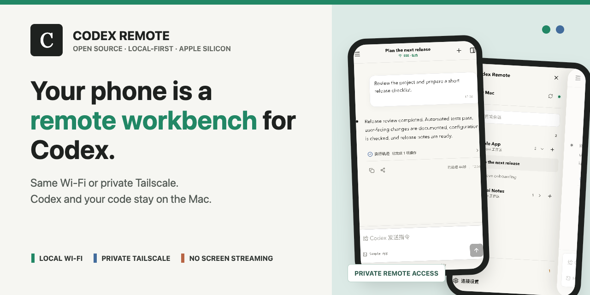
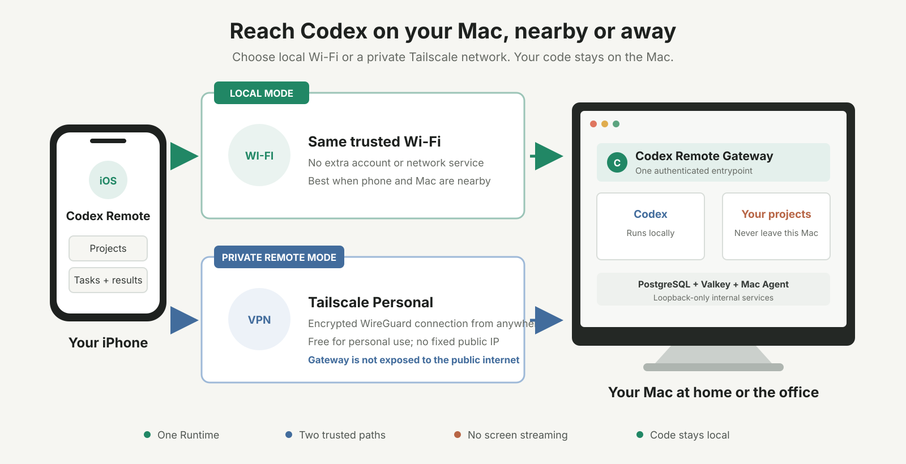

# Codex Remote

[](https://github.com/codex-remote/homebrew-tap/releases/tag/v0.2.0-beta.10)
[](https://github.com/codex-remote/codex-remote/actions/workflows/ci.yml)
[](LICENSE)
[](#requirements)
[](https://github.com/codex-remote/codex-remote)

[简体中文](README.zh-CN.md) | [Quick start](#quick-start) | [Use it away from home](docs/private-remote-access.md) | [Source](#source-code) | [Roadmap](ROADMAP.md)



**Same Wi-Fi or miles away, continue Codex on your Mac from your iPhone.**

Codex Remote turns an iPhone into a focused workbench for AI coding tasks.
Browse projects and sessions, start work, continue a conversation, follow live
output, and inspect results. It is not a remote desktop: your screen is not
streamed, and code, tools, and execution stay on your Mac.

> [!WARNING]
> This is an unsigned, unnotarized public Beta for Apple Silicon Macs and
> iPhone Safari. Remote access must use a private Tailscale network. Do not
> port-forward the Gateway or publish it with Tailscale Funnel.

## Two trusted access modes

| Mode | Best for | Network |
| --- | --- | --- |
| Local network | Phone and Mac on the same trusted Wi-Fi | No extra account; pair directly |
| Private remote | Reaching a Mac at home or the office while away | Install Tailscale; Personal is currently free for personal use |



Tailscale encrypts the phone-to-Mac path with WireGuard and requires no fixed
public IP, dynamic DNS, router port forwarding, or cloud Codex environment.
The Runtime and project data remain on the Mac.

## Quick start

### 1. Install the Runtime

```bash
brew trust --formula codex-remote/tap/codex-remote
brew install codex-remote/tap/codex-remote
```

### 2. Choose the projects available to your phone

```bash
codex-remote setup --workspace-root ~/work
```

### 3. Choose a network and pair

On the same local network:

```bash
codex-remote pair
```

For access away from home, install Tailscale on the Mac and iPhone, sign in to
the same [free Personal tailnet](https://tailscale.com/pricing), and follow the
[private remote access guide](docs/private-remote-access.md) for the current
public Beta.

Runtime source now includes automatic mode selection for the next Beta that
passes the release gates:

```bash
codex-remote network tailscale
codex-remote pair
```

Treat the QR code and complete pairing URL like a password. The credential
expires after 10 minutes by default and can be exchanged only once.

## Product preview

<p align="center">
  
  
</p>

The screenshots use sample projects and tasks and contain no personal data.

## What you can do

- Browse allowed Codex projects and historical sessions on your Mac.
- Start a task or continue an existing conversation from your phone.
- Follow live status, output, and final results.
- Interrupt work that is moving in the wrong direction.
- Keep projects, credentials, databases, and Codex execution on the Mac.
- Use one CLI for setup, pairing, health checks, repair, and upgrades.

## Security model

- The phone reaches only the Mobile Web Gateway. Run Server, Auth Control,
  PostgreSQL, Valkey, and internal Mac Agent interfaces remain hidden.
- A one-time pairing grant creates a device session; short-lived access tokens
  and rotating refresh tokens authorize later requests.
- Local mode is for a trusted network only.
- Tailscale mode encrypts the private path with WireGuard. The Tailnet URL is
  still HTTP inside that tunnel and is not a public HTTPS service.
- Moving between LAN and Tailnet origins requires pairing again.

See the [Homebrew Tap guide](https://github.com/codex-remote/homebrew-tap#security--network-model)
for installation, security, troubleshooting, and uninstall details.

## Requirements

- Apple Silicon Mac with macOS and [Homebrew](https://brew.sh/); Intel is not
  supported by this Beta.
- Codex CLI `0.148.0` or later, installed and signed in. Runtime
  `0.2.0-beta.10` was verified through `codex-cli 0.154.0-alpha.6.2`.
- iPhone Safari. Other mobile devices and browsers still need full acceptance.
- A Mac that remains powered on, connected, awake, and able to run Codex.
- Private remote mode requires the official Tailscale client on both devices
  and the same tailnet account.

## Source code

Codex Remote is Apache-2.0 open source and preserves independent repository
boundaries:

| Repository | What it contains |
| --- | --- |
| [iphone-app](https://github.com/codex-remote/iphone-app) | Native SwiftUI iPhone client |
| [mobile-web](https://github.com/codex-remote/mobile-web) | React mobile client and same-origin Gateway |
| [relay-server](https://github.com/codex-remote/relay-server) | Relay, Run Server, Runtime Auth, and public contracts |
| [mac-agent](https://github.com/codex-remote/mac-agent) | Local Codex execution and workspace adapter |
| [runtime-distribution](https://github.com/codex-remote/runtime-distribution) | Runtime CLI, supervisor, assembly, and release validation |
| [homebrew-tap](https://github.com/codex-remote/homebrew-tap) | Homebrew install, release assets, and operations guide |
| [docs](https://github.com/codex-remote/docs) | Product, architecture, protocol, and ADR documentation |

Repositories integrate through versioned contracts, schemas, fixtures, and
release manifests rather than sibling imports, submodules, or symlink sharing.

## Support the project

If Codex Remote helps your workflow:

- Star this repository so other local-first AI coding users can find it.
- Share your use case in [Discussions](https://github.com/codex-remote/codex-remote/discussions).
- Open a reproducible issue or pull request in the component that owns it.

Never upload a real pairing QR code, complete pairing link, credential, private
source, or unreviewed diagnostic log.

## Project status

The public Runtime is `0.2.0-beta.10`. The Tailscale path has been verified
from an iPhone on 5G to a Mac Gateway. Automatic network-mode selection is on
Runtime source and awaits the next Beta's clean-component, upgrade, and
real-device release gates. See the [Roadmap](ROADMAP.md).

Codex Remote is an independent community project. It is not affiliated with or
endorsed by OpenAI. Codex and OpenAI are trademarks of their respective owners.
