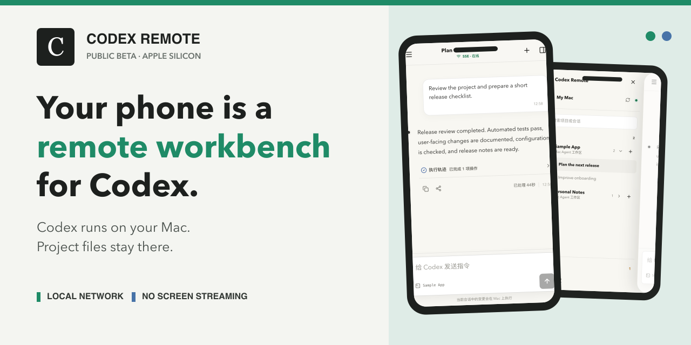
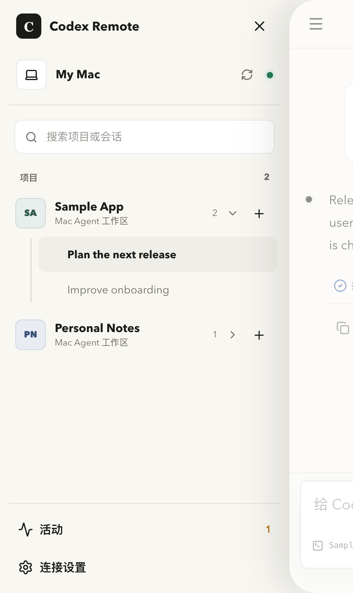
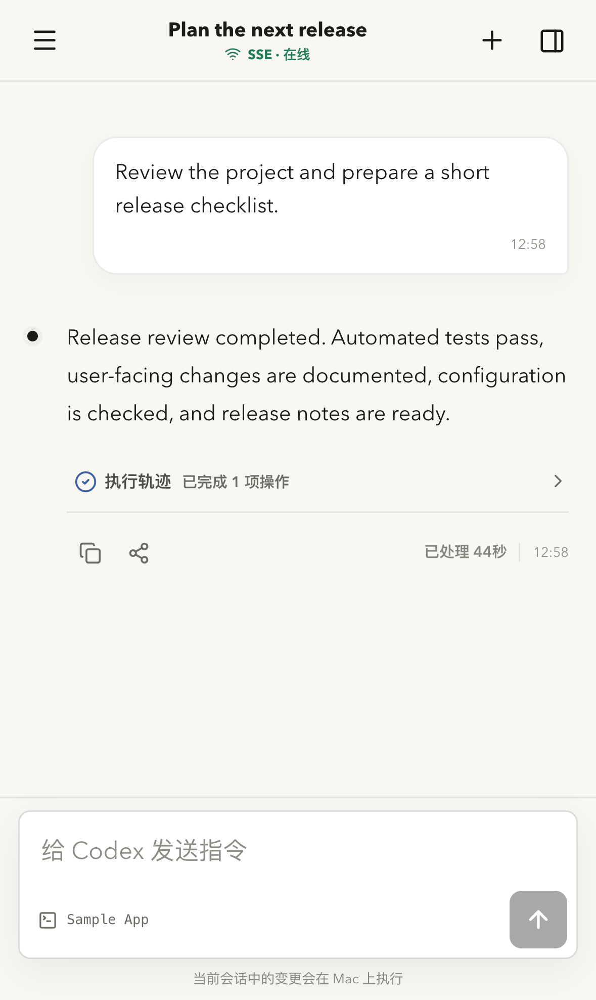
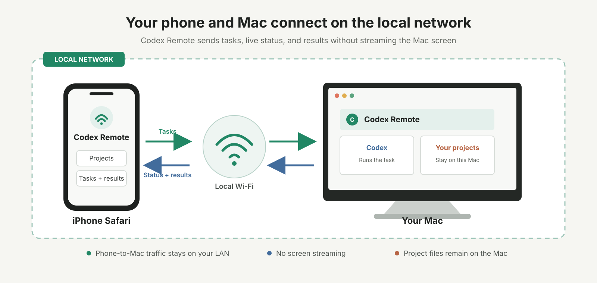

# Codex Remote

[](https://github.com/codex-remote/homebrew-tap/releases)
[](LICENSE)
[](#运行要求)
[](https://github.com/codex-remote/codex-remote/stargazers)

[English](README.md) | [快速开始](#快速开始) | [开源代码](#开源代码) | [路线图](ROADMAP.zh-CN.md) | [版本发布](https://github.com/codex-remote/homebrew-tap/releases)



**把手机作为远程工作台，继续使用运行于 Mac 的 Codex。**

在 Mac 上开始一个耗时任务，然后通过 iPhone 查看进度、发送后续要求或阅读结果。
Codex 和项目文件始终留在 Mac 上。Codex Remote 不是远程桌面，不传输整个屏幕，也不
控制鼠标和键盘。

> [!WARNING]
> Codex Remote 目前是预发布软件。公开 Beta 仅面向 Apple Silicon Mac 和同一局域网内
> 的 iPhone Safari，尚未签名或经过 Apple 公证，也不可以直接暴露到公网。

## 快速开始

### 1. 安装 Runtime

```bash
brew trust --formula codex-remote/tap/codex-remote
brew install codex-remote/tap/codex-remote
```

### 2. 选择手机可以访问的项目目录

```bash
codex-remote setup --workspace-root ~/work
```

### 3. 配对 iPhone

```bash
codex-remote pair
```

使用 iPhone 扫描终端二维码，选择项目和会话后即可继续工作。请把二维码和完整配对
链接当作密码保管：凭证默认 10 分钟后过期，而且只能兑换一次。

Setup、启动或手机连接异常时运行 `codex-remote doctor`。后续更新使用普通的
`brew upgrade codex-remote` 流程。

## 产品界面

<p align="center">
  
  
</p>

截图使用通用示例项目和任务，不包含个人工作区或真实会话数据。

## 可以做什么

- 查看 Mac 上可用的 Codex 项目和会话。
- 从手机发起任务，或继续已有对话。
- 实时查看任务状态并接收结果。
- 让执行过程、项目文件和 Runtime 持久数据留在 Mac 上。
- 使用一个 CLI 诊断整套本地服务，不需要逐个操作组件。

## 工作方式



手机连接 Mac 上的 Gateway。Gateway 通过版本化 HTTPS、SSE 和 WebSocket 契约连接
Relay 与 Mac Agent；Mac Agent 通过官方 App Server 接口使用 Codex。Runtime 使用
自己隔离的 PostgreSQL 和 Valkey 数据，不会替换用户已有的数据库。

## 运行要求

- 安装了 macOS 和 [Homebrew](https://brew.sh/) 的 Apple Silicon Mac。
- 已安装并登录 Codex CLI `0.148.0` 或更高版本。Runtime `0.2.0-beta.10` 已验证到
  `codex-cli 0.154.0-alpha.6.2`。
- iPhone Safari，并与 Mac 位于同一个可信局域网。
- Mac 保持开机、唤醒并能够运行 Codex。

当前 Beta 在手机与 Mac 之间使用普通 HTTP。不要做端口转发，不要通过隧道公开
Gateway，也不要在不可信网络中使用。安装前请阅读完整的
[安全与网络模型](https://github.com/codex-remote/homebrew-tap/blob/main/README.zh-CN.md#安全与网络模型)。

## 开源代码

Codex Remote 采用 Apache-2.0 开源。项目有意保持独立仓库，让每个组件可以单独构建、
测试、版本化和评审。

| 仓库 | 内容 |
| --- | --- |
| [iphone-app](https://github.com/codex-remote/iphone-app) | 原生 SwiftUI iPhone 客户端 |
| [mobile-web](https://github.com/codex-remote/mobile-web) | React 移动客户端与同源 Gateway |
| [relay-server](https://github.com/codex-remote/relay-server) | Relay、Run Server、Runtime 鉴权与公开契约 |
| [mac-agent](https://github.com/codex-remote/mac-agent) | 本地 Codex 执行与工作区适配器 |
| [admin-platform](https://github.com/codex-remote/admin-platform) | 本地诊断服务、Collector 与 Admin Web |
| [runtime-distribution](https://github.com/codex-remote/runtime-distribution) | Runtime CLI、Supervisor、组装与发布验证 |
| [homebrew-tap](https://github.com/codex-remote/homebrew-tap) | Homebrew Formula、发布产物与详细安装说明 |
| [docs](https://github.com/codex-remote/docs) | 产品、架构、协议与 ADR 文档 |

跨仓库集成只通过版本化契约、Schema、Fixture 和发布 Manifest 完成。项目不使用兄弟
目录源码导入、Git Submodule 或基于符号链接的代码共享。

## 构建与贡献

请从拥有对应组件的仓库开始。每个代码仓库都在自己的 README 中说明环境要求、开发
命令、重点测试和架构边界。

提交 Pull Request 前请阅读组织级[贡献指南](https://github.com/codex-remote/.github/blob/main/CONTRIBUTING.md)。
产品想法可以进入 [GitHub Discussions](https://github.com/codex-remote/codex-remote/discussions)，
可复现的问题请提交到对应仓库。不要上传配对链接、二维码、凭据、私有源码或未经
审查的诊断日志。

## 项目状态

当前公开 Runtime 是 `0.2.0-beta.10`。近期重点包括签名与公证分发、更完整的设备管理、
更广泛的真机回归，以及在支持公网访问前建立安全传输。当前边界见[路线图](ROADMAP.zh-CN.md)。

## 许可证与独立性

当前源码和未来 Runtime 产物采用 [Apache License 2.0](LICENSE)。此前发布的 Beta 1
至 Beta 3 归档保留其不可变产物内的原许可证。署名与项目名称说明见 [NOTICE](NOTICE)。

Codex Remote 是独立社区项目，与 OpenAI 没有关联或背书关系。Codex 和 OpenAI 是其
各自所有者的商标。
